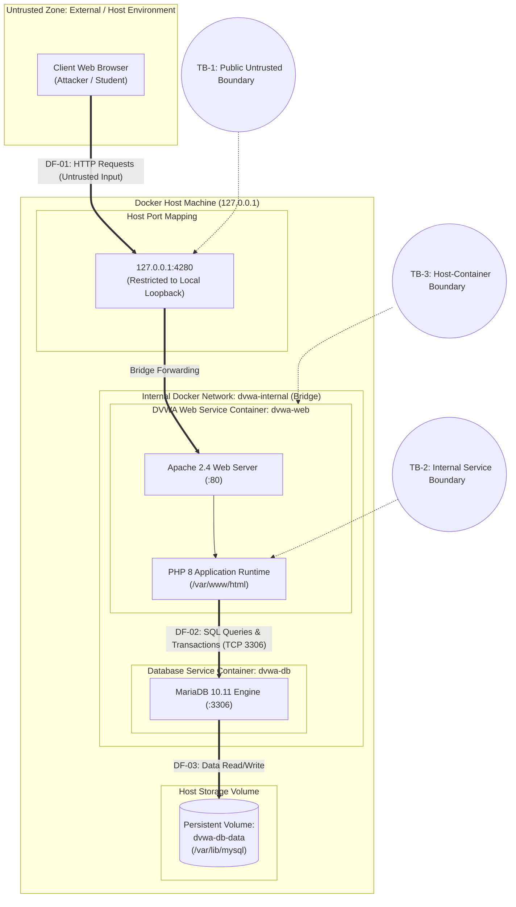
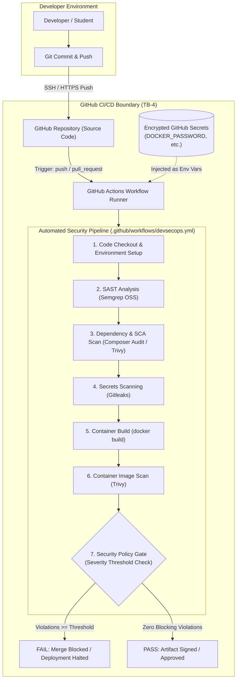

# System Architecture & Threat Boundaries

## 1. Executive Summary
This document defines the architectural specification, components, technologies, data flows, and trust boundaries for the Damn Vulnerable Web Application (DVWA) DevSecOps implementation. The system consists of a containerized multi-tier local runtime coupled with an automated GitHub Actions DevSecOps security pipeline.

---

## 2. Technology Stack & Component Inventory

| Component | Technology | Version / Base | Deployment Context | Listening Port(s) | Role & Responsibilities |
| :--- | :--- | :--- | :--- | :--- | :--- |
| **Client Browser** | Standard Web Browser | Modern HTML5/ES6 | Host / External User | Dynamic client ports | End-user interface for interacting with DVWA security exercises |
| **Web Tier** | Apache HTTP Server + PHP | Apache 2.4 / PHP 8 (`php:8-apache`) | Docker Container (`dvwa-web`) | `80` (mapped to `127.0.0.1:4280`) | Serves web assets, executes PHP application logic, enforces session state |
| **Database Tier** | MariaDB Relational DBMS | MariaDB 10.11 LTS | Docker Container (`dvwa-db`) | `3306` (Internal Docker network only) | Stores relational data (`users`, `guestbook`), enforces relational constraints |
| **Storage Layer** | Docker Named Volume | Local storage driver | Docker Host (`dvwa-db-data`) | N/A (Filesystem) | Persists database tables, user records, and logs across container recreation |
| **CI/CD Pipeline** | GitHub Actions | Ubuntu Latest Runner | Cloud Hosted Runner | N/A (Automated batch) | Automates SAST, SCA, secrets detection, container image build, and container security gating |

---

## 3. Architecture Diagrams

### 3.1 Runtime System Architecture & Trust Boundaries

### 3.2 DevSecOps CI/CD Pipeline & Scanner Boundary

---

## 4. Detailed Data Flows

### DF-01: User HTTP Interaction (Browser -> DVWA Web Container)
- **Source**: Web Browser on host.
- **Destination**: Apache HTTP Server on container `dvwa-web` via `127.0.0.1:4280`.
- **Protocol**: HTTP/1.1 (plaintext over localhost).
- **Data Carried**: HTTP GET/POST parameters, session cookies (`PHPSESSID`, `security`), user input payloads, and headers.
- **Security Considerations**: This data is considered untrusted. User input directly enters attack surfaces (SQL queries, HTML rendering, OS command arguments, state-changing requests).

### DF-02: Database Query Execution (DVWA Web -> MariaDB Container)
- **Source**: PHP runtime inside `dvwa-web`.
- **Destination**: MariaDB daemon inside `dvwa-db` at `db:3306`.
- **Protocol**: MySQL Native Protocol (TCP/IP).
- **Data Carried**: SQL queries, parameter bindings, authentication credentials, returned recordsets.
- **Security Considerations**: Communications are restricted to the isolated Docker network `dvwa-internal`. No host port mapping is exposed for port 3306, preventing direct external database connections.

### DF-03: Database Persistence (MariaDB Container -> Storage Volume)
- **Source**: MariaDB process.
- **Destination**: Docker named volume `dvwa-db-data`.
- **Protocol**: POSIX filesystem I/O.
- **Data Carried**: Database tablespaces (`ibdata1`), user tables, binlogs.
- **Security Considerations**: Filesystem permissions on the host restrict volume access to Docker root daemon.

### DF-04 & DF-05: DevSecOps CI/CD Automation (Repository -> Runner -> Scanners)
- **Source**: Developer workstation pushing commits to GitHub.
- **Destination**: GitHub Actions runner executing scanner containers/binaries.
- **Protocol**: HTTPS / Git over SSH.
- **Data Carried**: Source code, Dockerfile, Compose files, dependencies, build logs, scan reports (SARIF/JSON).
- **Security Considerations**: Scanners execute with read-only workspace permissions. Results dictate whether a pull request can be merged.

---

## 5. Trust Boundaries & Security Enclaves

### Trust Boundary 1 (TB-1): Public / Untrusted Boundary
- **Location**: Between the client web browser and the Apache web server at port `4280`.
- **Threat Vector**: Malicious users injecting malicious SQL, script tags, shell metacharacters, or forging cross-site requests.
- **Controls**: Strict input validation, parameterized queries, context-aware output encoding, anti-CSRF token verification, and loopback binding (`127.0.0.1`).

### Trust Boundary 2 (TB-2): Application-to-Database Internal Boundary
- **Location**: Between `dvwa-web` and `dvwa-db` across the `dvwa-internal` network.
- **Threat Vector**: Unauthorized lateral movement, database credential interception, privilege escalation.
- **Controls**: MariaDB does not publish port `3306` to the host; isolated Docker bridge network allows only containers on `dvwa-internal` to resolve `db`; dedicated non-root database user (`dvwa`) with restricted database-specific privileges.

### Trust Boundary 3 (TB-3): Container-to-Host Isolation Boundary
- **Location**: Between Docker engine container namespaces and the host Linux/Windows kernel.
- **Threat Vector**: Container breakout, host filesystem tampering, privileged command execution.
- **Controls**: Containers run unprivileged without `--privileged` flag; host filesystem is shielded except for explicit bind mount `./app` during development.

### Trust Boundary 4 (TB-4): CI/CD Pipeline Trust Boundary
- **Location**: Between the GitHub source repository, GitHub Secrets vault, and the Actions workflow runner.
- **Threat Vector**: Leaked CI tokens, poisoned pull requests modifying build actions, unauthorized release of images with critical vulnerabilities.
- **Controls**: Least privilege `permissions:` block in workflow; Gitleaks pre-commit and CI secrets scanning; Trivy non-zero exit gate on critical container vulnerabilities; zero plain-text secrets in repository files.
