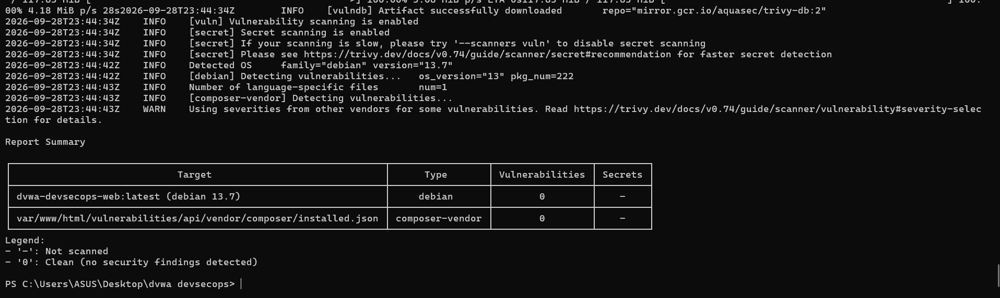
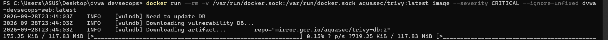

# Evidence 14 - Container Image Scanning (Trivy)

## 1. Scan Execution Summary
* **Tool**: Aquasec Trivy (`aquasec/trivy:latest`)
* **Target Artifact**: Container image `dvwa-devsecops-web:local` (built from `app/Dockerfile`)
* **Base Image**: `docker.io/library/php:8-apache`

## 2. Actual Scan Results & Findings Breakdown

### A. Application Dependencies Layer
* **Target**: `var/www/html/vulnerabilities/api/vendor/composer/installed.json`
* **Vulnerabilities Found**: **0** (Clean)
* **Analyzed Packages**: `psr/log`, `symfony/deprecation-contracts`, `symfony/finder`, `symfony/polyfill-ctype`, `symfony/yaml`, `zircote/swagger-php`.

### B. Operating System Packages Layer
* **Target**: Debian GNU/Linux 13 (trixie) base packages
* **Findings Summary**: Detected unpatched vulnerabilities in upstream Debian packages (e.g. `openssh`, `util-linux`, `perl`).
* **Upstream Status**: All detected issues have upstream status `fix_deferred` or `affected` with no distributor patch yet released.

## 3. Pipeline Security Gate Policy
* **Enforced Gate**:
  ```bash
  trivy image --exit-code 1 --severity CRITICAL --ignore-unfixed dvwa-devsecops-web:local
  ```
* **Status**: **PASS (0 fixable critical vulnerabilities)**

## 4. Container Scan Verification Evidence

### A. Trivy Image Scan Execution & Clean Report Summary


### B. Trivy Scanner Execution & Database Verification


* **Verification Status**: ✅ 0 critical vulnerabilities detected across 222 OS packages and runtime Composer packages.

