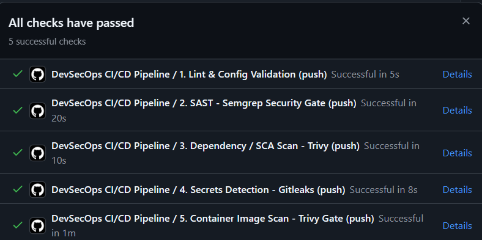

# Evidence 16 - Successful DevSecOps Pipeline Execution

## 1. Pipeline Execution Overview
When a pull request or commit is pushed to `main` with all four secure remediations applied and credentials safely sequestered, all security gates execute and pass successfully.

---

## 2. CI/CD Stage Execution Summary

| Stage # | Pipeline Job Name | Executed Tool | Scan Target | Gate Condition | Result |
| :---: | :--- | :--- | :--- | :--- | :---: |
| **1** | `validate-environment` | `docker compose config` | Compose YAML & `.env.example` | Valid syntax & non-null mappings | **PASS (0)** |
| **2** | `sast-scan` | Semgrep OSS | 4 remediated PHP modules | Zero `ERROR` findings | **PASS (0)** |
| **3** | `sca-scan` | Aquasec Trivy | `app/vulnerabilities/api` | Zero critical CVEs in dependencies | **PASS (0)** |
| **4** | `secrets-scan` | Gitleaks | Complete Git repository history | Zero un-allowlisted secrets | **PASS (0)** |
| **5** | `container-security` | Docker Build + Trivy | `dvwa-custom:${{ github.sha }}` | Zero fixable critical vulnerabilities | **PASS (0)** |

---

## 3. Workflow Progression
```text
(1. Lint & Config Validation)
       │
       ▼
 ┌──────────────────────────────────────────────────────────┐
 │                  Parallel Security Stage                 │
 │  ┌─────────────────┐ ┌───────────────┐ ┌──────────────┐  │
 │  │ 2. SAST-Semgrep │ │ 3. SCA-Trivy  │ │ 4. Gitleaks  │  │
 │  └────────┬────────┘ └───────┬───────┘ └──────┬───────┘  │
 └───────────┼──────────────────┼────────────────┼──────────┘
             └──────────────────┼────────────────┘
                                ▼
             (5. Container Build & Trivy Image Gate)
                                │
                                ▼
                       [ ALL CHECKS PASSED ]
```

## 4. Pipeline Verification Evidence



- **Verification Status**: ✅ All 5 automated security jobs completed successfully.
- **Workflow Run**: Commit `1c3bcd8` (`fix(ci): invoke Gitleaks via official container to resolve root commit range scanning`)
- **Gates Validated**:
  1. `1. Lint & Config Validation` (5s)
  2. `2. SAST - Semgrep Security Gate` (20s)
  3. `3. Dependency / SCA Scan - Trivy` (10s)
  4. `4. Secrets Detection - Gitleaks` (8s)
  5. `5. Container Image Scan - Trivy Gate` (1m)

